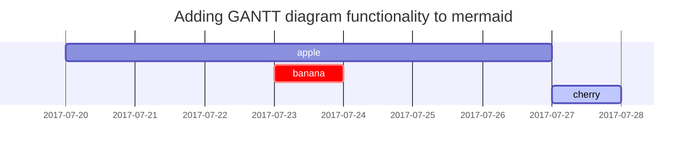

This post is to show Markdown syntax rendering on [**Chirpy**](https://github.com/cotes2020/jekyll-theme-chirpy/fork), you can also use it as an example of writing. Now, let's start looking at text and typography.


## Prerequisites

Follow the instructions in the [Jekyll Docs](https://jekyllrb.com/docs/installation/) to complete the installation of `Ruby`, `RubyGems`, `Jekyll`, and `Bundler`. In addition, [Git](https://git-scm.com/) is also required to be installed.

## Installation

### Creating a New Site

There are two ways to create a new repository for this theme:

- [**Using the Chirpy Starter**](#option-1-using-the-chirpy-starter) - Easy to upgrade, isolates irrelevant project files so you can focus on writing.
- [**Forking on GitHub**](#option-2-forking-on-github) - Convenient for custom development, but difficult to upgrade. Unless you are familiar with Jekyll and are determined to tweak or contribute to this project, this approach is not recommended.

#### Option 1. Using the Chirpy Starter

Create a new repository from the [**Chirpy Starter**][use-starter] and name it `<GH_USERNAME>.github.io`, where `GH_USERNAME` represents your GitHub username.

#### Option 2. Forking on GitHub

[Fork **Chirpy**](https://github.com/cotes2020/jekyll-theme-chirpy/fork) on GitHub and rename it to `<GH_USERNAME>.github.io`. Please note that the default branch code is in development.  If you want the site to be stable, please switch to the [latest tag][latest-tag] and start writing.

And then execute:

```console
$ bash tools/init
```

> If you don't want to deploy your site on GitHub Pages, append option `--no-gh` at the end of the above command.
{: .prompt-info }

The above command will:

1. Remove the files in `_posts`{: .filepath} from your repository.

2. If the option `--no-gh` is provided, the directory `.github`{: .filepath} will be deleted. Otherwise, set up the GitHub Action workflow by removing the extension `.hook`{: .filepath} of `.github/workflows/pages-deploy.yml.hook`{: .filepath}, and then remove the other files and directories in the folder `.github`{: .filepath}.

3. Create a new commit to save the changes automatically.

### Installing Dependencies

Before running for the first time, go to the root directory of your site, and install dependencies as follows:

```console
$ bundle
```

## Usage

### Configuration

Update the variables of `_config.yml`{: .filepath} as needed. Some of them are typical options:

- `url`
- `avatar`
- `timezone`
- `lang`

### Customizing Stylesheet

If you need to customize the stylesheet, copy the theme's `assets/css/style.scss`{: .filepath} to the same path on your Jekyll site, and then add the custom style at the end of it.

Starting with version `4.1.0`, if you want to overwrite the SASS variables defined in `_sass/addon/variables.scss`{: .filepath}, copy the main sass file `_sass/jekyll-theme-chirpy.scss`{: .filepath} into the `_sass`{: .filepath} directory in your site's source, then create a new file `_sass/variables-hook.scss`{: .filepath} and assign new value.

### Customing Static Assets

Static assets configuration was introduced in version `5.1.0`. The CDN of the static assets is defined by file `_data/assets/cross_origin.yml`{: .filepath }, and you can replace some of them according to the network conditions in the region where your website is published.

Also, if you'd like to self-host the static assets, please refer to the [_chirpy-static-assets_](https://github.com/cotes2020/chirpy-static-assets#readme).

### Running Local Server

You may want to preview the site contents before publishing, so just run it by:

```console
$ bundle exec jekyll s
```

Or run the site on Docker with the following command:

```console
$ docker run -it --rm \
    --volume="$PWD:/srv/jekyll" \
    -p 4000:4000 jekyll/jekyll \
    jekyll serve
```

After a while, the local service will be published at _<http://127.0.0.1:4000>_.

## Deployment

Before the deployment begins, check out the file `_config.yml`{: .filepath} and make sure the `url` is configured correctly. Furthermore, if you prefer the [**project site**](https://help.github.com/en/github/working-with-github-pages/about-github-pages#types-of-github-pages-sites) and don't use a custom domain, or you want to visit your website with a base URL on a web server other than **GitHub Pages**, remember to change the `baseurl` to your project name that starts with a slash, e.g, `/project-name`.

Now you can choose ONE of the following methods to deploy your Jekyll site.

### Deploy by Using GitHub Actions

Ensure your Jekyll site has the file `.github/workflows/pages-deploy.yml`{: .filepath}. Otherwise, create a new one and fill in the contents of the [sample file][workflow], and the value of the `on.push.branches` should be the same as your repo's default branch name. And then rename your repository to `<GH_USERNAME>.github.io` on GitHub.

Furthermore, if you have committed `Gemfile.lock`{: .filepath} to the repository and your local machine is not Linux, go the the root directory of your site and update the platform list:

```console
$ bundle lock --add-platform x86_64-linux
```

Now publish your Jekyll site:

1. Browse to your repository on GitHub. Select the tab _Settings_, then click _Pages_ in the left navigation bar. Then, in the **Source** section (under _Build and deployment_), select [**GitHub Actions**][pages-workflow-src] from the dropdown menu.

2. Push any commit to remote to trigger the GitHub Actions workflow. In the _Actions_ tab of your repository, you should see the workflow _Build and Deploy_ running. Once the build is complete and successful, the site should be deployed automatically.

3. Visit your website at the address indicated by GitHub.

### Manually Build and Deploy

On self-hosted servers, you cannot enjoy the convenience of **GitHub Actions**. Therefore, you should build the site on your local machine and then upload the site files to the server.

Go to the root of the source project, and build your site as follows:

```console
$ JEKYLL_ENV=production bundle exec jekyll b
```

Or build the site on Docker:

```console
$ docker run -it --rm \
    --env JEKYLL_ENV=production \
    --volume="$PWD:/srv/jekyll" \
    jekyll/jekyll \
    jekyll build
```

Unless you specified the output path, the generated site files will be placed in folder `_site`{: .filepath} of the project's root directory. Now you should upload those files to the target server.

## Upgrading

It depends on how you use the theme:

- If you are using the theme gem (there will be `gem "jekyll-theme-chirpy"` in the `Gemfile`{: .filepath}), editing the `Gemfile`{: .filepath} and update the version number of the theme gem, for example:

  ```diff
  - gem "jekyll-theme-chirpy", "~> 3.2", ">= 3.2.1"
  + gem "jekyll-theme-chirpy", "~> 3.3", ">= 3.3.0"
  ```
  {: .nolineno file="Gemfile" }

  And then execute the following command:

  ```console
  $ bundle update jekyll-theme-chirpy
  ```

  As the version upgrades, the critical files (for details, see the [Startup Template][starter]) and configuration options will change. Please refer to the [Upgrade Guide](https://github.com/cotes2020/jekyll-theme-chirpy/wiki/Upgrade-Guide) to keep your repo's files in sync with the latest version of the theme.

- If you forked from the source project (there will be `gemspec` in the `Gemfile`{: .filepath} of your site), then merge the [latest upstream tags][latest-tag] into your Jekyll site to complete the upgrade.
  The merge is likely to conflict with your local modifications. Please be patient and careful to resolve these conflicts.

[starter]: https://github.com/cotes2020/chirpy-starter
[use-starter]: https://github.com/cotes2020/chirpy-starter/generate
[workflow]: https://github.com/cotes2020/jekyll-theme-chirpy/blob/master/.github/workflows/pages-deploy.yml.hook
[pages-workflow-src]: https://docs.github.com/en/pages/getting-started-with-github-pages/configuring-a-publishing-source-for-your-github-pages-site#publishing-with-a-custom-github-actions-workflow
[latest-tag]: https://github.com/cotes2020/jekyll-theme-chirpy/tags


## Titles
---
# H1 - heading

<h2 data-toc-skip>H2 - heading</h2>

<h3 data-toc-skip>H3 - heading</h3>

<h4>H4 - heading</h4>
---

## Paragraph

Quisque egestas convallis ipsum, ut sollicitudin risus tincidunt a. Maecenas interdum malesuada egestas. Duis consectetur porta risus, sit amet vulputate urna facilisis ac. Phasellus semper dui non purus ultrices sodales. Aliquam ante lorem, ornare a feugiat ac, finibus nec mauris. Vivamus ut tristique nisi. Sed vel leo vulputate, efficitur risus non, posuere mi. Nullam tincidunt bibendum rutrum. Proin commodo ornare sapien. Vivamus interdum diam sed sapien blandit, sit amet aliquam risus mattis. Nullam arcu turpis, mollis quis laoreet at, placerat id nibh. Suspendisse venenatis eros eros.

## Lists

### Ordered list

1. Firstly
2. Secondly
3. Thirdly

### Unordered list

- Chapter
  + Section
    * Paragraph

### ToDo list

- [ ] Job
  + [x] Step 1
  + [x] Step 2
  + [ ] Step 3

### Description list

Sun
: the star around which the earth orbits

Moon
: the natural satellite of the earth, visible by reflected light from the sun

## Block Quote

> This line shows the _block quote_.

## Prompts

> An example showing the `tip` type prompt.
{: .prompt-tip }

> An example showing the `info` type prompt.
{: .prompt-info }

> An example showing the `warning` type prompt.
{: .prompt-warning }

> An example showing the `danger` type prompt.
{: .prompt-danger }

## Tables

| Company                      | Contact          | Country |
|:-----------------------------|:-----------------|--------:|
| Alfreds Futterkiste          | Maria Anders     | Germany |
| Island Trading               | Helen Bennett    | UK      |
| Magazzini Alimentari Riuniti | Giovanni Rovelli | Italy   |

## Links

<http://127.0.0.1:4000>

## Footnote

Click the hook will locate the footnote[^footnote], and here is another footnote[^fn-nth-2].

## Inline code

This is an example of `Inline Code`.

## Filepath

Here is the `/path/to/the/file.extend`{: .filepath}.

## Code blocks

### Common

```
This is a common code snippet, without syntax highlight and line number.
```

### Specific Language

```bash
if [ $? -ne 0 ]; then
  echo "The command was not successful.";
  #do the needful / exit
fi;
```

### Specific filename

```sass
@import
  "colors/light-typography",
  "colors/dark-typography"
```
{: file='_sass/jekyll-theme-chirpy.scss'}

## Mathematics

The mathematics powered by [**MathJax**](https://www.mathjax.org/):

$$ \sum_{n=1}^\infty 1/n^2 = \frac{\pi^2}{6} $$

When $a \ne 0$, there are two solutions to $ax^2 + bx + c = 0$ and they are

$$ x = {-b \pm \sqrt{b^2-4ac} \over 2a} $$

## Mermaid SVG



## Images

### Default (with caption)

{: width="972" height="589" }
_Full screen width and center alignment_

### Left aligned

{: width="972" height="589" .w-75 .normal}

### Float to left

{: width="972" height="589" .w-50 .left}
Praesent maximus aliquam sapien. Sed vel neque in dolor pulvinar auctor. Maecenas pharetra, sem sit amet interdum posuere, tellus lacus eleifend magna, ac lobortis felis ipsum id sapien. Proin ornare rutrum metus, ac convallis diam volutpat sit amet. Phasellus volutpat, elit sit amet tincidunt mollis, felis mi scelerisque mauris, ut facilisis leo magna accumsan sapien. In rutrum vehicula nisl eget tempor. Nullam maximus ullamcorper libero non maximus. Integer ultricies velit id convallis varius. Praesent eu nisl eu urna finibus ultrices id nec ex. Mauris ac mattis quam. Fusce aliquam est nec sapien bibendum, vitae malesuada ligula condimentum.

### Float to right

{: width="972" height="589" .w-50 .right}
Praesent maximus aliquam sapien. Sed vel neque in dolor pulvinar auctor. Maecenas pharetra, sem sit amet interdum posuere, tellus lacus eleifend magna, ac lobortis felis ipsum id sapien. Proin ornare rutrum metus, ac convallis diam volutpat sit amet. Phasellus volutpat, elit sit amet tincidunt mollis, felis mi scelerisque mauris, ut facilisis leo magna accumsan sapien. In rutrum vehicula nisl eget tempor. Nullam maximus ullamcorper libero non maximus. Integer ultricies velit id convallis varius. Praesent eu nisl eu urna finibus ultrices id nec ex. Mauris ac mattis quam. Fusce aliquam est nec sapien bibendum, vitae malesuada ligula condimentum.

### Dark/Light mode & Shadow

The image below will toggle dark/light mode based on theme preference, notice it has shadows.

{: .light .w-75 .shadow .rounded-10 w='1212' h='668' }
{: .dark .w-75 .shadow .rounded-10 w='1212' h='668' }

## Video



The [favicons](https://www.favicon-generator.org/about/) of [**Chirpy**](https://github.com/cotes2020/jekyll-theme-chirpy/) are placed in the directory `assets/img/favicons/`{: .filepath}. You may want to replace them with your own. The following sections will guide you to create and replace the default favicons.

## Generate the favicon

Prepare a square image (PNG, JPG, or SVG) with a size of 512x512 or more, and then go to the online tool [**Real Favicon Generator**](https://realfavicongenerator.net/) and click the button <kbd>Select your Favicon image</kbd> to upload your image file.

In the next step, the webpage will show all usage scenarios. You can keep the default options, scroll to the bottom of the page, and click the button <kbd>Generate your Favicons and HTML code</kbd> to generate the favicon.

## Download & Replace

Download the generated package, unzip and delete the following two from the extracted files:

- `browserconfig.xml`{: .filepath}
- `site.webmanifest`{: .filepath}

And then copy the remaining image files (`.PNG`{: .filepath} and `.ICO`{: .filepath}) to cover the original files in the directory `assets/img/favicons/`{: .filepath} of your Jekyll site. If your Jekyll site doesn't have this directory yet, just create one.

The following table will help you understand the changes to the favicon files:

| File(s)             | From Online Tool                  | From Chirpy |
|---------------------|:---------------------------------:|:-----------:|
| `*.PNG`             | ✓                                 | ✗           |
| `*.ICO`             | ✓                                 | ✗           |

>  ✓ means keep, ✗ means delete.
{: .prompt-info }

The next time you build the site, the favicon will be replaced with a customized edition.

## Reverse Footnote

[^footnote]: The footnote source
[^fn-nth-2]: The 2nd footnote source
